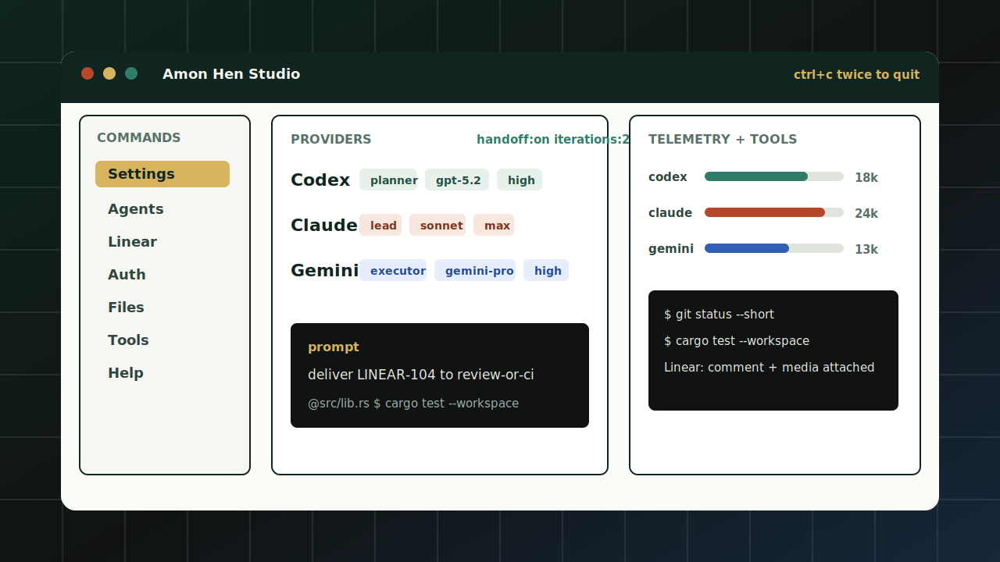
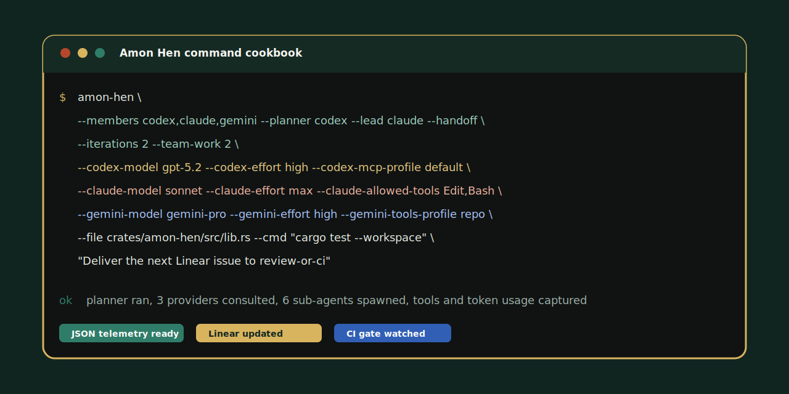
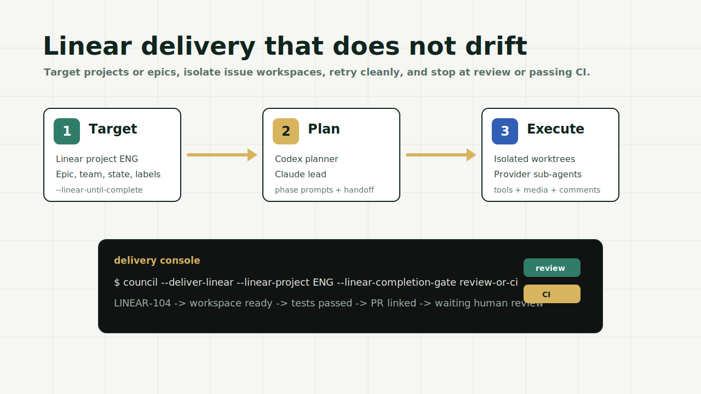

<div align="center">
  
  <h1>Amon Hen</h1>
  <p><strong>The Seat of Seeing for AI engineering work.</strong></p>
  <p>
    A Rust-native command center for Codex, Claude, Gemini, and Linear delivery loops.
  </p>
  <p>
    <a href="https://amonhen.legit.place">Website</a>
    ·
    <a href="crates/council/README.md">CLI docs</a>
    ·
    <a href="https://github.com/Dviros/Amon-Hen/actions">CI</a>
    ·
    <a href="SECURITY.md">Security</a>
  </p>
</div>



## What This Is

Amon Hen turns local AI coding CLIs into a coordinated delivery team. Codex can plan, Claude can lead, Gemini can execute, and each provider can spawn its own same-provider sub-agents when the task needs more hands. You get one native terminal surface for roles, handoffs, iterations, auth, provider capability overrides, token telemetry, tool logs, local files, command context, and Linear delivery.

The shipped binary remains `council` for compatibility. The project identity is Amon Hen.

This is a ground-up Rust implementation. The CLI and delivery runtime live in the Cargo workspace.

## Why It Feels Different

- It runs the provider CLIs you already authenticate locally: `codex`, `claude`, and `gemini`.
- It lets you choose a planner, lead, executors, handoff mode, iteration count, and provider-specific effort.
- It exposes provider-native config instead of flattening everything into a fake common denominator.
- It can watch Linear projects or epics until each issue lands at human review or a GitHub CI gate.
- It shows the uncomfortable-but-useful stuff: token usage, tool commands, prompt commands, file context, retries, and reconciliation state.
- It ships a native Rust Studio TUI for interactive work, not a static ASCII status dump.

## Install

```bash
cargo install --path crates/council
```

From a checkout:

```bash
cargo run -p council -- --help
```

Provider binary paths can be overridden when needed:

```bash
COUNCIL_CODEX_BIN=/path/to/codex \
COUNCIL_CLAUDE_BIN=/path/to/claude \
COUNCIL_GEMINI_BIN=/path/to/gemini \
council --auth-status --capabilities-status
```

## Command Cookbook

Open the interactive Studio:

```bash
council --studio --members codex,claude,gemini
```

Ask all providers and synthesize one answer:

```bash
council \
  --members codex,claude,gemini \
  "Inspect this repo and propose the cleanest next patch"
```

Pick roles, handoff, iterations, and same-provider sub-agents:

```bash
council \
  --members codex,claude,gemini \
  --planner codex \
  --lead claude \
  --handoff \
  --iterations 2 \
  --team-work 2 \
  "Design and implement the next safe change"
```

Control model and effort per provider:

```bash
council \
  --members codex,claude,gemini \
  --codex-model gpt-5.2 \
  --codex-effort high \
  --claude-model sonnet \
  --claude-effort max \
  --gemini-model gemini-pro \
  --gemini-effort high \
  "Compare implementation options and choose one"
```

Override provider permissions and capability surfaces:

```bash
council \
  --members codex,claude,gemini \
  --codex-sandbox workspace-write \
  --codex-config ~/.codex/config.toml \
  --codex-mcp-profile repo \
  --claude-permission-mode acceptEdits \
  --claude-mcp-config .claude/mcp.json \
  --claude-allowed-tools Edit,Bash,Read \
  --claude-disallowed-tools WebFetch \
  --gemini-settings .gemini/settings.json \
  --gemini-tools-profile repo \
  "Make the patch, run tests, and report exactly what changed"
```

Launch provider social login flows:

```bash
council \
  --auth-login \
  --auth-login-providers codex,claude,gemini
```

Attach local files and command output to the prompt:

```bash
council \
  --members codex,claude,gemini \
  --file crates/council/src/lib.rs \
  --cmd "cargo test --workspace --locked" \
  --cmd "cargo clippy --workspace --locked -- -D warnings" \
  "Review this change and identify the next fix"
```

Run a long-lived Linear delivery loop:

```bash
council \
  --deliver-linear \
  --linear-project ENG \
  --linear-until-complete \
  --linear-completion-gate review-or-ci \
  --linear-limit 4 \
  --linear-max-attempts 3 \
  --members codex,claude,gemini \
  --planner codex \
  --lead claude \
  --team-work 2
```

Emit machine-readable telemetry:

```bash
council \
  --json \
  --members codex,claude,gemini \
  --team-work 1 \
  "Summarize tool usage, tokens, and final recommendation"
```



## Studio

Studio is the native TUI for live work:

- movable panes for settings, agents, results, Linear, auth, files, tools, capabilities, and help
- manual auth method selection per provider
- browser-tab social login handoff with code paste or deeplink support
- lead/planner/executor role changes after launch
- per-provider model, effort, sandbox, permissions, and capability settings
- provider Skills, MCP, and tools inherit/override toggles
- token, sub-agent, prompt-command, and tool-command telemetry
- double-Ctrl+C exit so one accidental interrupt does not kill a long run

## Linear Delivery

Amon Hen can treat Linear as the work queue, not just a ticket reference.



The delivery loop can:

- poll targeted projects, epics, teams, states, assignees, or explicit issues
- create isolated workspaces per issue
- run planner, execution, verification, reconciliation, and reporting phases
- retry with backoff and persist issue state
- attach generated media and command outputs back to Linear
- post progress comments and optional review-state updates
- wait for GitHub CI or hand work to human review

## Repository Layout

```text
.
├── crates/council/      # Rust crate and council binary
├── web/                 # Product site
├── docs/screenshots/    # README visuals
└── .github/workflows/   # CI and release automation
```

## Development

CLI:

```bash
cargo fmt --all --check
cargo build --workspace --locked
cargo test --workspace --locked
cargo clippy --workspace --locked -- -D warnings
```

## Contributors

- [Dviros](https://github.com/Dviros)

## Security

Do not commit provider tokens, Cloudflare tokens, Linear tokens, local absolute paths, or command history containing secrets. If a token has been pasted into a terminal, chat, or deploy log, rotate it after use.

See [SECURITY.md](SECURITY.md).

## License

[MIT](LICENSE)
